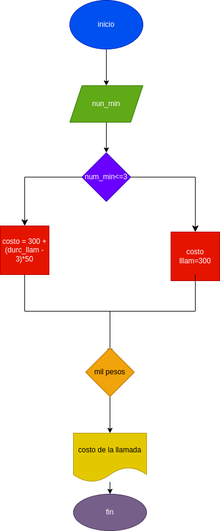

# llamada_telefonica
# programa para calcular el costo de una llamada telefonica

ingresar el tiempo de duracion de una llamada telefonica y determinar la cantidad a pagar, de acuerdo con lo siguiente:
- toda llamada q dure 3 minutos o menoss tiene un costo de 300 pesos
- cada minuto adicional cuesta 50 pesos
# diseño
## diagrama de flujo

